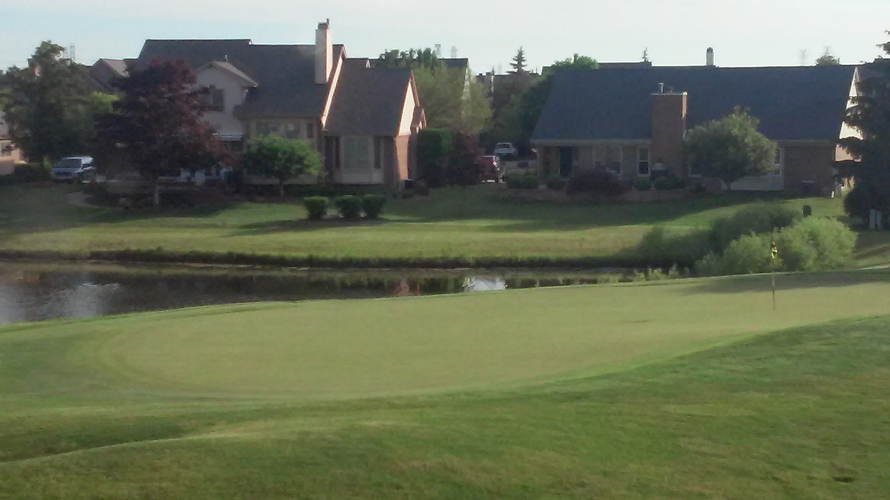

# moved_hole

We have two images of a hole at a golf course taken from roughly the same place with the same camera but at dfferent times and different zoom levels. The flag marking the hole seems to move between the images -- we intend to find if and how much by registering the two images together. The source images are:

   

