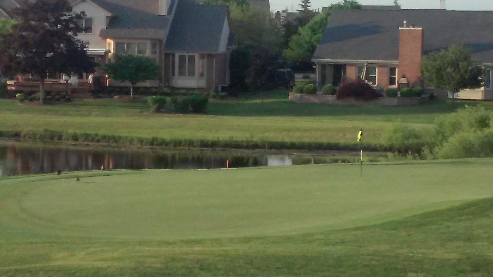
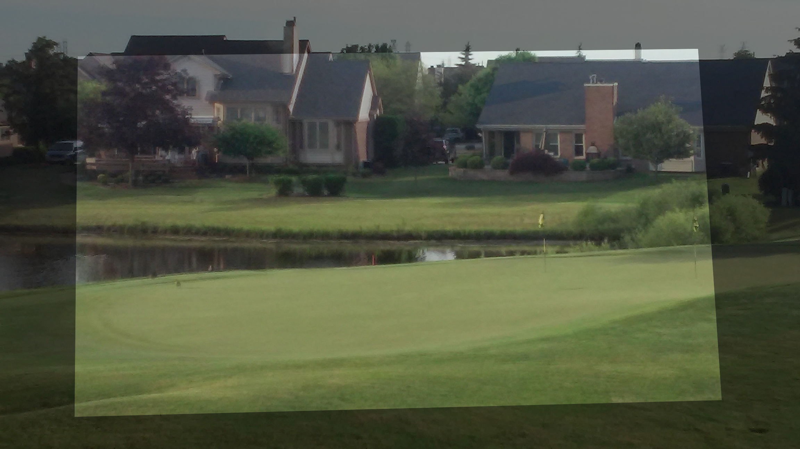

# moved_hole

*Problem*: We have two images of a hole at a golf course taken from roughly the same place with the same camera but at dfferent times and different zoom levels. The flag marking the hole seems to move between the images. Was the hole moved? The source images are:

   

*Method*: Using OpenCV, we employ the SIFT feature detector and descriptor to find interesting keypoints in both images, select good matches, and use them to estimate a perspective transformation between the images. The result of running `golf.py` is the image "1.jpg" warped as if taken from the same camera as "2.jpg"

*Result*: Using GIMP, we overlapped the warped "1.jpg" into "2.jpg". The result is

  

The images seem to match well, so we can use this image to answer our question. The overlapped image shows that the flag (and hole) did in fact move. We further learned that golf courses routinely (and sometimes daily) move the holes on the green to maintain novelty in the course and force players to use different strategies when approaching the green.
